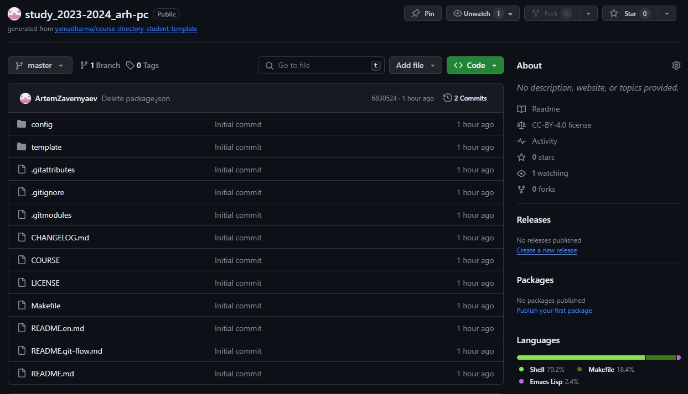
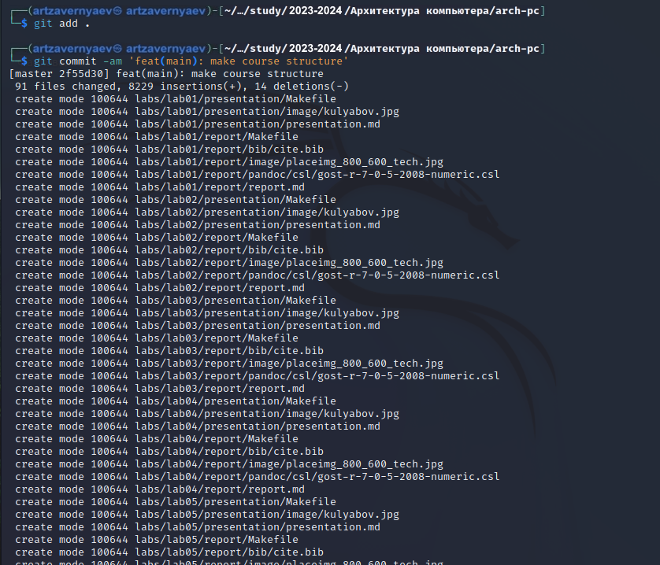
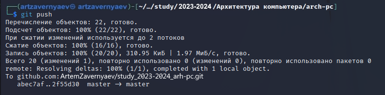
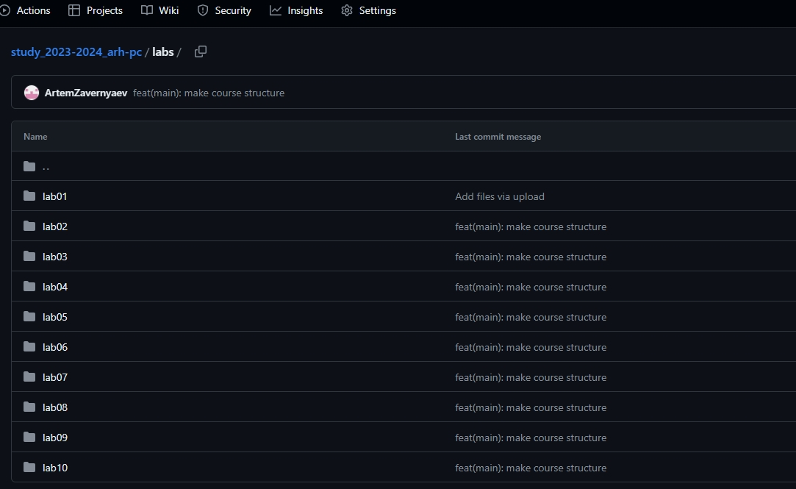

---
## Front matter
title: "Отчёт по лабораторной работе №2"
subtitle: "Дисциплина: Архитектура компьютера"
author: "Заверняев Артём Игоревич"

## Generic otions
lang: ru-RU
toc-title: "Содержание"

## Bibliography
bibliography: bib/cite.bib
csl: pandoc/csl/gost-r-7-0-5-2008-numeric.csl

## Pdf output format
toc: true # Table of contents
toc-depth: 2
lof: true # List of figures
fontsize: 12pt
linestretch: 1.5
papersize: a4
documentclass: scrreprt
## I18n polyglossia
polyglossia-lang:
  name: russian
  options:
	- spelling=modern
	- babelshorthands=true
polyglossia-otherlangs:
  name: english
## I18n babel
babel-lang: russian
babel-otherlangs: english
## Fonts
mainfont: PT Serif
romanfont: PT Serif
sansfont: PT Sans
monofont: PT Mono
mainfontoptions: Ligatures=TeX
romanfontoptions: Ligatures=TeX
sansfontoptions: Ligatures=TeX,Scale=MatchLowercase
monofontoptions: Scale=MatchLowercase,Scale=0.9
## Biblatex
biblatex: true
biblio-style: "gost-numeric"
biblatexoptions:
  - parentracker=true
  - backend=biber
  - hyperref=auto
  - language=auto
  - autolang=other*
  - citestyle=gost-numeric
## Pandoc-crossref LaTeX customization
figureTitle: "Рис."
tableTitle: "Таблица"
listingTitle: "Листинг"
lofTitle: "Список иллюстраций"
lolTitle: "Листинги"
## Misc options
indent: true
header-includes:
  - \usepackage{indentfirst}
  - \usepackage{float} # keep figures where there are in the text
  - \floatplacement{figure}{H} # keep figures where there are in the text
---

#	Цель работы

Целью данной работы является изучить идеологию и применение средств контроля версий, а также приобрести практические навыки по работе с системой git.
 
#	Задание

1.	Настройка GitHub.
2.	Базовая настройка Git.
3.	Создание SSH-ключа.
4.	Создание рабочего пространства и репозитория курса на основе шаблона.
5.	Создание репозитория курса на основе шаблона.
6.	Настройка каталога курса.
7.	Выполнение заданий для самостоятельной работы.
 
#	Теоретическое введение

Системы контроля версий (Version Control System, VCS) применяются при ра- боте нескольких человек над одним проектом. Обычно основное дерево проекта хранится в локальном или удалённом репозитории, к которому настроен до- ступ для участников проекта. При внесении изменений в содержание проекта система контроля версий позволяет их фиксировать, совмещать изменения, произведённые разными участниками проекта, производить откат к любой более ранней версии проекта, если это требуется. В классических системах контроля версий используется централизованная модель, предполагающая наличие еди- ного репозитория для хранения файлов. Выполнение большинства функций по управлению версиями осуществляется специальным сервером. Участник про- екта (пользователь) перед началом работы посредством определённых команд получает нужную ему версию файлов. После внесения изменений пользователь размещает новую версию в хранилище. При этом предыдущие версии не уда- ляются из центрального хранилища и к ним можно вернуться в любой момент. Сервер может сохранять не полную версию изменённых файлов, а производить так называемую дельта-компрессию — сохранять только изменения между по- следовательными версиями, что позволяет уменьшить объём хранимых данных. Системы контроля версий поддерживают возможность отслеживания и разреше- ния конфликтов, которые могут возникнуть при работе нескольких человек над одним файлом. Можно объединить изменения, сделанные разными участниками, вручную выбрать нужную версию, отменить изменения вовсе или заблокиро- вать файлы для изменения. В зависимости от настроек блокировка не позволяет другим пользователям получить рабочую копию или препятствует изменению рабочей копии файла средствами файловой системы ОС, обеспечивая таким образом привилегированный доступ только одному пользователю, работающему с файлом. Системы контроля версий также могут обеспечивать дополнительные, более гибкие функциональные возможности. Например, они могут поддерживать работу с несколькими версиями одного файла, сохраняя общую историю измене- ний до точки ветвления версий и собственные истории изменений каждой ветви. Обычно доступна информация о том, кто из участников, когда и какие изменения вносил. Обычно такого рода информация хранится в журнале изменений, доступ к которому можно ограничить. В отличие от классических, в распределённых системах контроля версий центральный репозиторий не является обязательным. Среди классических VCS наиболее известны CVS, Subversion, а среди распределённых — Git, Bazaar, Mercurial. Принципы их работы схожи, отличаются они в основном синтаксисом используемых в работе команд. Система контроля версий Git представляет собой набор программ командной строки. Доступ к ним можно получить из терминала посредством ввода команды git с различными опциями. Благодаря тому, что Git является распределённой системой контроля версий, резервную копию локального хранилища можно сделать простым копированием или архивацией. Работа пользователя со своей веткой начинается с проверки и получения изменений из центрального репозитория (при этом в локальное дерево до начала этой процедуры не должно было вноситься изменений). Затем можно вносить изменения в локальном дереве и/или ветке. После завершения внесения какого-то изменения в файлы и/или каталоги проекта необходимо разместить их в центральном репозитории.

#	Выполнение лабораторной работы

##	Настройка GitHub
Так как у меня уже есть учетная запись на сайте GitHub, я пропущу процесс её создания. 

##	Базовая настройка Git
Открываю виртуальную машину, затем открываю терминал и делаю пред- варительную конфигурацию git. Ввожу команду git config –global user.name “”, указывая свое имя и команду git config –global user.email “work@mail”, указывая в ней свою электронную почту (корпоративную почту) (рис. [-@fig:001]).

{ #fig:001 width=70% }

Настраиваю utf-8 в выводе сообщений git для корректного отображения символов (рис. [-@fig:002]).

{ #fig:002 width=70% }

Задаю имя «master» для начальной ветки (рис. [-@fig:003]).

 { #fig:003 width=70% }

Задаю параметр autocrlf со значением input, так как я работаю в системе Linux, чтобы конвертировать CRLF в LF только при коммитах (рис. [-@fig:004]). CR и LF – это сим- волы, которые можно использовать для обозначения разрыва строки в текстовых файлах.

{ #fig:004 width=70% }

Задаю параметр safecrlf со значением warn, так Git будет проверять преоб- разование на обратимость (рис. [-@fig:005]). 

{ #fig:005 width=70% }

##	Создание SSH-ключа
Для последующей идентификации пользователя на сервере репозиториев необ- ходимо сгенерировать пару ключей (приватный и открытый). Для этого ввожу
команду ssh-keygen -C “Имя Фамилия, work@email”, указывая своё имя и свою электронную почту (рис. [-@fig:006]). Ключ автоматически сохранится в каталоге ~/.ssh/.

{ #fig:006 width=70% }

Копирую открытый ключ из директории, в которой он был сохранен. 
Открываю браузер, захожу на сайт GitHub. Открываю свой профиль и выбираю страницу «SSH and GPG keys». Нажимаю кнопку «New SSH key» (рис. [-@fig:007]).

{ #fig:007 width=70% }

Вставляю скопированный ключ в поле «Key». В поле Title указываю имя для ключа. Нажимаю «Add SSH-key», чтобы завершить добавление ключа (рис. [-@fig:008]). 

{ #fig:008 width=70% }

##	Создание рабочего пространства 
Закрываю браузер, открываю терминал. Создаю директорию, рабочее про- странство, с помощью утилиты mkdir, блягодаря ключу -p создаю все директории после домашней ~/work/study/2022-2023/“Архитектура компьютера” рекурсивно. Далее проверяю с помощью ls, действительно ли были созданы необходимые мне каталоги (рис. [-@fig:009]).

 { #fig:009 width=70% }

##	Создание репозитория курса на основе шаблона
В браузере перехожу на страницу репозитория с шаблоном курса по адресу https://github.com/yamadharma/course-directory-student-template. Далее выбираю
«Use this template», чтобы использовать этот шаблон для своего репозитория (рис. [-@fig:010]).

 { #fig:010 width=70% }

В открывшемся окне задаю имя репозитория (Repository name): study_2022–2023_arh- pc и создаю репозиторий, нажимаю на кнопку «Create repository from template»
(рис. [-@fig:011]).

 { #fig:011 width=70% }

Проверю, что репозиторий создан (рис. [-@fig:012]).

 { #fig:012 width=70% }

Через терминал перехожу в созданный каталог курса с помощью утилиты cd (рис. [-@fig:013]).

 { #fig:013 width=70% }

Клонирую созданный репозиторий с помощью команды git clone –recursive git@github.com:/study_2023–2024_arh-pc.git arch-pc (рис. [-@fig:014]).

 { #fig:014 width=70% }

Копирую ссылку для клонирования на странице созданного репозитория, сна- чала перейдя в окно «code», далее выбрав в окне вкладку «SSH» (рис. [-@fig:015]).

 { #fig:015 width=70% }

##	Настройка каталога курса
Перехожу в каталог arch-pc с помощью утилиты cd (рис. [-@fig:016]).

{ #fig:016 width=70% }

Удаляю лишние файлы с помощью утилиты rm (рис. [-@fig:017]).

{ #fig:017 width=70% }

Создаю необходимые каталоги (рис. [-@fig:018]).

{ #fig:018 width=70% }

Отправляю созданные каталоги с локального репозитория на сервер: добавляю все созданные каталоги с помощью git add, комментирую и сохраняю изменения на сервере как добавление курса с помощью git commit (рис. [-@fig:019]).

{ #fig:019 width=70% }

Отправляю все на сервер с помощью push (рис. [-@fig:020]).

{ #fig:020 width=70% }

Проверяю правильность выполнения работы сначала на самом сайте GitHub (рис. [-@fig:021]).

{ #fig:021 width=70% }

##	Выполнение заданий для самостоятельной работы
Копирую первую лабораторную с помощью утилиты cp и проверяю правиль- ность выполнения команды cp с помощью ls (рис. [-@fig:022]).

{ #fig:022 width=70% }

Перехожу в подкаталог lab01/report с помощью утилиты cd.
Перехожу в директорию, в которой находится отчет по первой лабораторной работе с помощью cd. Добавляю файл с отчетом по первой лабораторной работе (рис. [-@fig:023]).

 { #fig:023 width=70% }

Отправляю в центральный репозиторий сохраненные изменения командой git push -f origin master (рис. [-@fig:024]).

{ #fig:024 width=70% }

Проверяю на сайте GitHub правильность выполнения заданий. Вижу, что пояснение к совершенным действиям отображается.
Вижу, что отчет по первой лабораторной работе находится в репозитории lab01/report (рис. [-@fig:025]). 

{ #fig:025 width=70% }

#	Вывод

При выполнении данной лабораторной работы я изучил идеологию и при- менение средств контроля версий, а также приобрела практические навыки по работе с системой git.
 
#	Список литературы

1.	Лекционный материал по курсу Архитектура компьютеров
